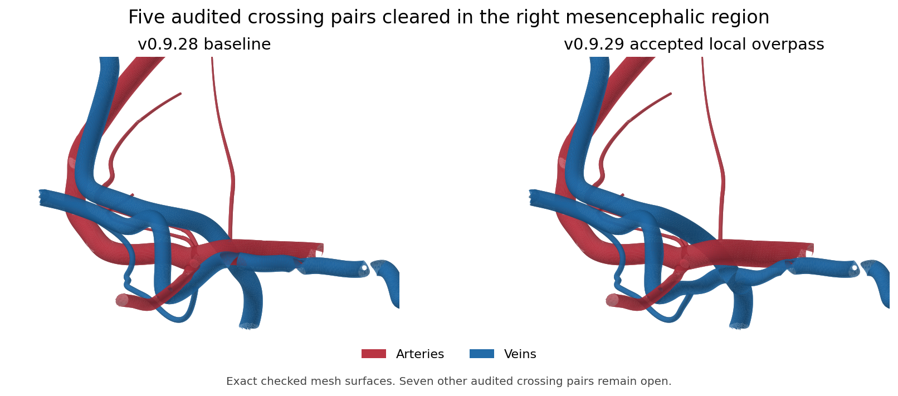
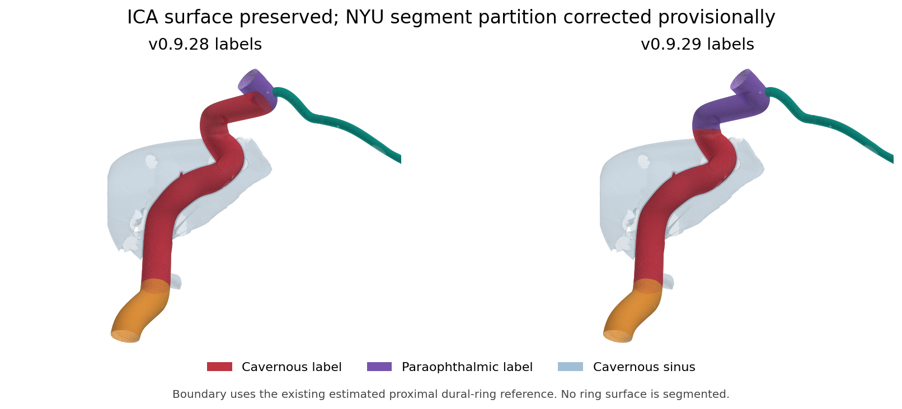

# Anatomical corrections, v0.9.29

This release implements the supported corrections from the v0.9.28 audit. It corrects 67 descriptions, two catalogue parents, six mixed surface/outlet course specifications, five of the twelve audited posterior artery–vein crossing pairs, and the provisional cavernous/paraophthalmic ICA mesh partition. Normal variations remain accepted. This is a review build: the complete anatomical model is not approved.

The full atlas remains included: 1,648 structures, 1,395 relationships and 1,232 named meshes across five production assets. Page 3 retains P01–P31 with 69 selectable mesh labels. Page 2 retains 22 families and 44 mesh labels, excluding transmedullary veins. Brain, skull and potential-anastomosis geometry are unchanged. The central arterial fit is preserved.

## Correction register

| Audit item | Result in this release | Outstanding work |
| --- | --- | --- |
| G01 Straight sinus | Original connected geometry retained; the model panel identifies the registration conflict. | Review the falcotentorial tissue junction and Galen/ISS/straight/torcular complex together. The current guide and sinus cannot both be treated as correct. |
| G02 Posterior artery–vein intersections | Five pairs clear after one local connected venous adjustment. No new independent-compartment contact pairs detected for the changed labels. | Seven audited pairs remain open, listed below. Broad venous and arterial displacement trials introduced new contacts and were withheld. |
| G03 Bony canals | Unresolved canal/vessel contacts identified in the affected model panels. No bone carving or speculative artery displacement applied. | Independent canal tracing or better resolved skull data is needed to separate ostial contact, absent lumen detail and genuine trajectory error. |
| G04 Cavernous ICA boundary | Upper triangles are assigned to the NYU paraophthalmic label at the existing estimated proximal dural-ring reference. The arterial surface and branches are unchanged. | This provisional boundary is not a segmented or independently verified dural ring. Shared soft-tissue/skull calibration remains open. No sinus sleeve was added. |
| G05 Pericallosal course | Original connected arterial geometry retained; model panels identify the unresolved callosal relationship. | A regional trial introduced cingulate, callosal and venous contacts. Define the connected pericallosal and branch courses against a reconciled sulcal reference before refitting. |
| M01 Vidian contribution parent | Both catalogue parents now follow the actual lower cavernous-labelled ostia. Children, branch relationships and course attachments agree. | Petrous/lacerum origin variation is retained in the description; this selected parent is not a universal origin claim. |
| M02 Page-3 surface/outlet modes | Bilateral peduncular, tectal and great-horizontal-fissure labels each have bounded pial/fissural and cisternal portions. The model panel shows the two phases. | Transition stations are authoring estimates, not independently segmented tissue boundaries. Fine placement still requires review. |
| T01 Ophthalmic terminology | Optic canal and posterior ciliary terminology corrected bilaterally. Selected superior nerve crossing qualified as variable. | None for this text correction. |
| T02 Posterior ciliary origins | Four descriptions allow variable branch order and common trunks. | None for this text correction. |
| T03 MCA cortical descriptions | 46 M4 descriptions distinguish convexity supply from earlier insular/opercular branches. Two temporo-occipital descriptions no longer link to the ECA occipital artery. | None for these text/link corrections. |
| T04 Internal cerebral veins | Formation and termination descriptions include anterior septal, thalamostriate and variable choroidal contributions, with variable basal venous termination. | No geometry displacement inferred from broad neural-target distances. |
| T05 Vertebral segments | V1 entry-level variability corrected; V4 begins at dural penetration, distinguished from passage through the atlanto-occipital membrane. | Individual cervical vertebral levels and exact dural entry are not resolved. |
| T06 Anterior spinal artery | Three descriptions allow unilateral/bilateral contributions, variable union and segmental reinforcement. PICA dominance and a universal C2–C4 union removed. | The model union is not assigned a vertebral level. |

## Accepted local geometry

A compact, smooth coordinate field moves four connected venous labels in the right anterior mesencephalic region. Maximum displacement is 2.472 mm in the lateral mesencephalic and posterior communicating labels, 1.391 mm in the cerebral peduncular label and 0.510 mm in the anterior pontomesencephalic label. Every label uses the same coordinate field, including shared collars. These numbers are model authoring settings, not clinical normality limits.

| Audited pair now clear | Baseline triangle contacts | Current triangle contacts |
| --- | ---: | ---: |
| PCA P1 right / lateral mesencephalic vein right | 265 | 0 |
| PCA P1 right / posterior communicating vein | 390 | 0 |
| PCA P2–P3 right / posterior communicating vein | 56 | 0 |
| Posterior communicating artery right / posterior communicating vein | 63 | 0 |
| Thalamoperforator 2 right / lateral mesencephalic vein right | 93 | 0 |

Contact counts depend on tessellation and filter settings. A zero surface-intersection result supports separation of these particular mesh walls; it does not certify the entire anatomical course or lumen.

The retained shared-junction graph has 323 direct venous label pairs and 672 arterial label pairs, with no lost pairs. The analytic lower bound on the venous field's Jacobian determinant is positive (0.185), and sampled changed vertices remain positive. No new folds or degenerate triangles are detected. The same-network map preserves existing self-intersection relationships; it does not certify the original network free of intersections.

The source calibre profiles are retained as authoring references. A smooth coordinate deformation does not preserve every cross-section exactly. The approximate geodesic-section check reports median radius ratios of 1.000, with 95th-percentile absolute fractional radius changes of 7.4% (lateral mesencephalic), 5.0% (cerebral peduncular), 20.0% (posterior communicating) and 6.1% (anterior pontomesencephalic). These illustrative small-vein calibres remain unreviewed. The course contract explicitly records measured wall deformation rather than claiming exact calibre preservation. This estimate excludes cap-adjacent points and is not a physiological stenosis assessment.

## ICA partition

The pre-existing estimated proximal ring references are at z = 70.935 mm on the right and 70.854 mm on the left. Classification by original triangle centroid transfers 11,205 right and 11,418 left upper cavernous triangles into the paraophthalmic labels. This produces a mesh-defined seam near the estimated plane; it does not insert an exact planar ring surface. The original complete arterial triangle union is byte-identical in position and winding after repartition. All original arterial junction pairs remain present. Ophthalmic, MHT and ILT origins retain their geometry. The independent cavernous sinus cavity is unchanged.

## Remaining seven crossing pairs

| Artery | Vein | Current audited contacts |
| --- | --- | ---: |
| Basilar | Anterior pontomesencephalic | 95 |
| SCA right | Anterior pontomesencephalic | 303 |
| Vertebral V4 left | Marginal sinus | 17 |
| Vertebral V4 left | Pontomedullary left | 378 |
| Vertebral V4 right | Anterior medullary | 279 |
| Vertebral V4 right | Pontomedullary right | 108 |
| Vertebral V4 right | Pontomedullary left | 210 |

The rejected broad venous displacement introduced brain and vessel contacts. A broad arterial displacement introduced skull, neural and venous contacts. The rejected pericallosal trial introduced cingulate, callosal and venous contacts. These trials are described by the retained rejection reports, and no rejected geometry is loaded by the app.

## Course metadata and validation

The six audited mixed courses have adjacent source-point ranges covering the full source path. The surface portion retains its named neural targets. The cisternal outlet has no pial apposition requirement. Bounds are selected at the final supported surface station before sustained departure towards the receiving vein. The support envelope uses the source radius plus 1 mm as an authoring criterion; it is not a clinical clearance threshold. Exact path coordinates, hashes and arc-length ranges are recorded. This corrects course interpretation without claiming independently verified microscopic transitions.

The validator now permits distinct segment target/station subsets, requires their union to equal the complete course, and rejects omitted path ranges, overlaps, gaps, invalid source indices, stale coordinates and false arc lengths. Eight regression cases pass. Existing single-phase course contracts remain validated.

The catalogue, TypeScript and production build pass. The actual Three.js GLTFLoader and MeshoptDecoder load the exported assets with exact expected positions and indices and unit changed normals. Unchanged labels retain their exact geometry. Authoritative references are in the correction register and atlas source list; no article illustrations or full articles are embedded.

## Evidence and reproduction

Current reports in `docs/validation` include:

- `anatomical-correction-register-v0.9.29.json`: all 13 audit items and authoritative source links.
- `anatomical-text-corrections-v0.9.29.json`: before/after descriptions and parent corrections.
- `anatomical-course-partitions-v0.9.29.json`: bounded surface/outlet transitions.
- `anatomical-mesh-authoring-v0.9.29.json`, `anatomical-mesh-quality-v0.9.29.json`, `anatomical-clearance-v0.9.29.json`, `anatomical-export-v0.9.29.json` and `anatomical-loader-v0.9.29.json`.
- `anatomical-rejected-trials-v0.9.29.json`: reasons wider candidates were withheld.

Run `npm ci`, `npm run build` and `python3 tools/brain/test_course_segments.py` for application validation. Geometry authoring additionally needs NumPy, SciPy and VTK. From the parent of the app directory, retain the v0.9.28 baseline assets in `fixes-work/baseline`, its manifest as `fixes-work/baseline/manifest.json`, and decode the baseline with `node app/tools/decode-posterior-baseline.mjs fixes-work/baseline audit-work/decoded`. Then run `build_geometry.py`, `check_candidate.py` and `check_quality.py` in `tools/anatomical-fixes-v0929`. The checked asset exporter requires the exact baseline hashes. Large intermediate buffers and rejected GLB trials are not included in the installation ZIP.

## Principal anatomical references

The correction register retains all 20 sources from the audit, including primary studies and specialist anatomical reviews. The principal sources for applied changes are:

1. Matsushima T, Rhoton AL Jr, de Oliveira E, Peace D. Microsurgical anatomy of the veins of the posterior fossa. J Neurosurg. 1983;59:63–105. doi:10.3171/jns.1983.59.1.0063. [Source](https://pubmed.ncbi.nlm.nih.gov/6602865/).
2. Shapiro M et al. Toward an Endovascular Internal Carotid Artery Classification System. AJNR. 2014;35:230–236. doi:10.3174/ajnr.A3666. [Source](https://pubmed.ncbi.nlm.nih.gov/23928138/).
3. Microsurgical Anatomy of the Clinoidal Segment of the Internal Carotid Artery, Carotid Cave, and Paraclinoid Space. Barrow Quarterly. 2002;18(1). [Source](https://www.barrowneuro.org/for-physicians-researchers/education/grand-rounds-publications-media/barrow-quarterly/volume-18-no-1-2002/microsurgical-anatomy-of-the-clinoidal-segment-of-the-internal-carotid-artery-carotid-cave-and-paraclinoid-space/).
4. Poblete T, Casanova D, Soto M, Campero A, Mura J. Microsurgical Anatomy of the Anterior Circulation of the Brain Adjusted to the Neurosurgeon’s Daily Practice. Brain Sci. 2021;11:519. doi:10.3390/brainsci11040519. [Source](https://pmc.ncbi.nlm.nih.gov/articles/PMC8073207/).
5. Perrini P, Cardia A, Fraser K, Lanzino G. A microsurgical study of the anatomy and course of the ophthalmic artery and its possibly dangerous anastomoses. J Neurosurg. 2007;106:142–150. doi:10.3171/jns.2007.106.1.142. [Source](https://pubmed.ncbi.nlm.nih.gov/17236500/).
6. Meila D et al. Origin and course of the extracranial vertebral artery: CTA findings and embryologic considerations. Clin Neuroradiol. 2012;22:327–333. PMID:22941252. [Source](https://pubmed.ncbi.nlm.nih.gov/22941252/).
7. Tsutsumi S, Ono H, Ishii H, Yasumoto Y. Vertebral artery segment at the suboccipital dural penetration site: an anatomical study using magnetic resonance imaging. 2019. PMID:30820640. [Source](https://pubmed.ncbi.nlm.nih.gov/30820640/).
8. Brzegowy K et al. The Internal Cerebral Vein: New Classification of Branching Patterns Based on CTA. AJNR. 2019;40:1719–1724. doi:10.3174/ajnr.A6200. [Source](https://pubmed.ncbi.nlm.nih.gov/31488502/).
9. Tubbs RS et al. Surgical anatomy and landmarks for the basal vein of Rosenthal. J Neurosurg. 2007;106:900–902. doi:10.3171/jns.2007.106.5.900. [Source](https://pubmed.ncbi.nlm.nih.gov/17542537/).
10. Geibprasert S et al. Dangerous extracranial-intracranial anastomoses and supply to the cranial nerves: vessels the neurointerventionalist needs to know. AJNR. 2009. PMID:19279274. [Source](https://pubmed.ncbi.nlm.nih.gov/19279274/).
11. Er U, Fraser K, Lanzino G. The anterior spinal artery origin: a microanatomical study. Spinal Cord. 2008;46:45–49. doi:10.1038/sj.sc.3102060. [Source](https://www.nature.com/articles/3102060).
These references guide anatomical definitions and accepted variation. They do not independently establish patient-specific placement for this composite teaching model.
