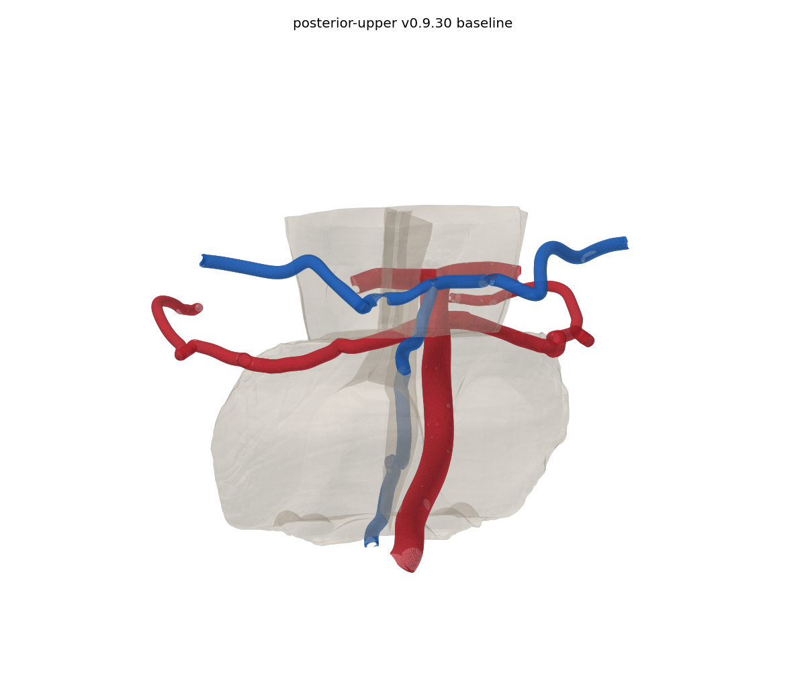
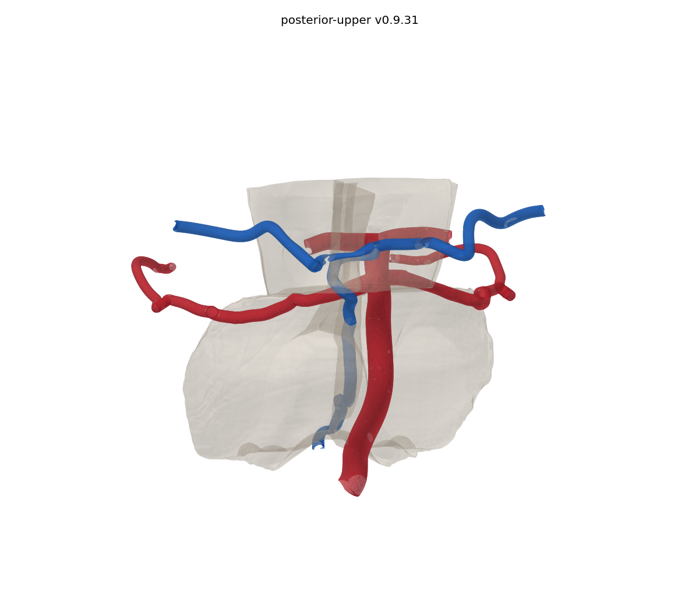
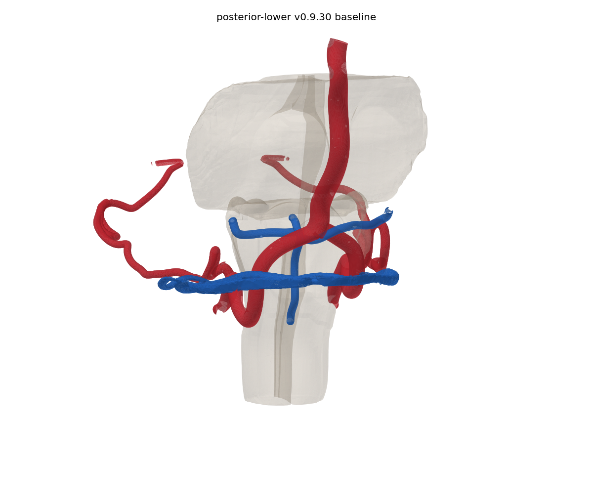
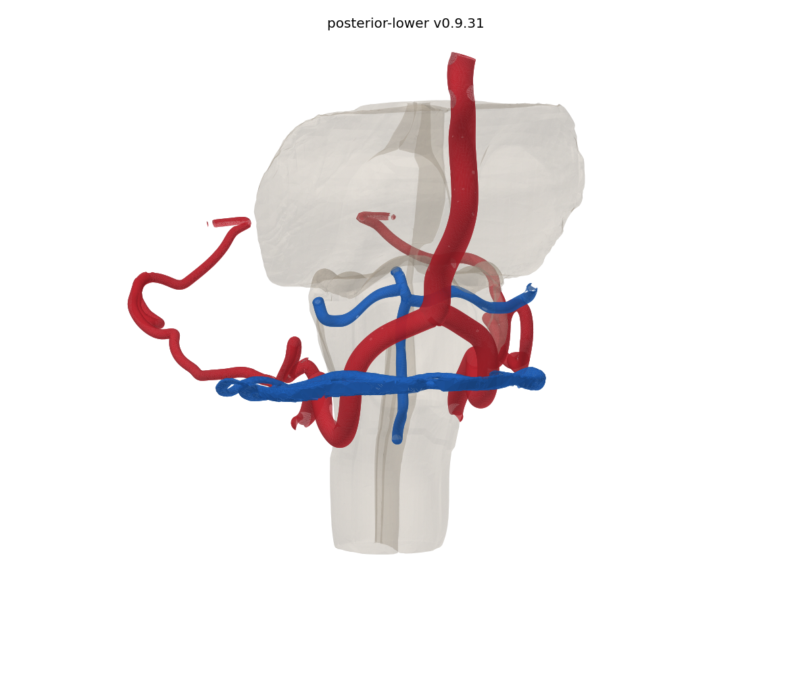

# Anatomical crossing corrections, v0.9.31

The seven remaining audited posterior artery-vein crossing pairs are corrected. All twelve pairs, including the five cleared in v0.9.29, are checked against the final exported mesh buffers. This is a local geometry correction and remains an anatomical review build.

## Applied changes

Local venous and brainstem placement fields separate the upper pontomesencephalic and lower vertebral crossing regions. A small marginal-vein adjustment clears the remaining left vertebral contact. Arterial trunks, skull and potential-anastomosis assets retain their exact v0.9.30 bytes. Every named structure and catalogue relationship is retained.

The upper correction uses an integrated smooth placement field rather than a single displacement that folds the wall. Round shaft offsets are recovered on five affected veins. Shared boundary vertices, original indices and the existing folded ostial neighbourhoods are preserved. The branched posterior communicating collector is retained after its trial resweep introduced new contacts. Calibres remain illustrative, and the measured wall changes are recorded rather than represented as exact calibre preservation.

The tissue context is adjusted with the pial veins, followed by a small local peduncular recess. All surface-bound landmarks are recomputed from their unchanged triangle indices and barycentric coordinates. Brain registration, vessel-course bindings, asset hashes, bounds and inspection-panel findings are refreshed.

| Artery | Vein | Final audited surface contacts |
| --- | --- | --- |
| Basilar | Median anterior pontomesencephalic | 0 |
| Right SCA | Median anterior pontomesencephalic | 0 |
| Left vertebral V4 | Marginal | 0 |
| Left vertebral V4 | Left pontomedullary | 0 |
| Right vertebral V4 | Anterior medullary | 0 |
| Right vertebral V4 | Right pontomedullary | 0 |
| Right vertebral V4 | Left pontomedullary | 0 |

The five preceding corrected pairs are also clear. Exact pair counts and the additional clearance sweep are in [the final clearance report](validation/anatomical-clearance-v0.9.31.json).

## Verification and limits

- Final staged triangle surfaces are checked for all twelve audited crossings and newly introduced contact pairs with arteries, bone, neural context and other veins. Pre-existing contacts are recorded separately.
- All original direct shared-vertex junction pairs in the changed assets are retained.
- Final vertices are finite and no extra degenerate triangles are introduced. The placement field has positive sampled Jacobians. Those Jacobians describe the placement step, not the subsequent vein-wall recovery.
- Each recovered vein wall is checked for newly introduced non-adjacent self-contact pairs against its placement-stage input. Existing folds at ostia are retained and are not claimed to be repaired.
- Meshopt position/index round-trips are lossless. The actual Three.js loader verifies all changed buffers and exact retention of unchanged positions and indices. Exported normals are checked.
- The production build validates the catalogue, course contracts and updated brain anchors, compiles TypeScript and produces the Vite bundle and compressed assets. The existing eight course-contract tests are run.

See [mesh quality](validation/anatomical-mesh-quality-v0.9.31.json), [recovered walls](validation/anatomical-recovered-walls-v0.9.31.json), [loader verification](validation/anatomical-loader-v0.9.31.json) and [release checks](validation/anatomical-release-checks-v0.9.31.json). No independent whole-model anatomical approval is claimed. No browser-based interaction or Docker deployment was tested in this release.

## Matched views

These are renders of the measured meshes with identical cameras and context opacity. Brain display decimation is used only for rendering; collision checks use the full-resolution meshes.

| v0.9.30 | v0.9.31 |
| --- | --- |
|  |  |
|  |  |

## Remaining corrections

| Finding | Status and evidence |
| --- | --- |
| G01, straight sinus and falcotentorial junction | Open. Moving the dural ridge to the retained sinus introduced new cortical and arterial contacts. The trial is excluded. A reviewed joint sinus/dural refit is still required. |
| G03, fine bony canals | Open. The supplied coarse skull does not resolve continuous canal lumina. The optic, carotid, infraorbital and mandibular routes need independently traced canal geometry and joint calibration. No artificial canal has been cut into the skull. |
| G04, ICA/dural calibration | The v0.9.29 provisional segment boundary is retained. Independently reviewed dural-ring surfaces are still unavailable. |
| G05, pericallosal route | Open. Connected callosal fitting trials introduced new cingulate, septal and venous contacts. These trials are excluded. The arterial family and its joined branches require a reviewed regional refit. |

Rejected trials and their measured contacts are in [the trial report](validation/anatomical-rejected-trials-v0.9.31.json). The [current correction register](validation/anatomical-correction-register-v0.9.31.json) keeps these findings open. Earlier description, parent, ICA boundary and six bounded venous course corrections remain included.

## Anatomical sources and interpretation

The earlier [correction register](validation/anatomical-correction-register-v0.9.29.json) retains the original source bibliography and the extent consulted. The following primary anatomical studies informed the regional interpretation. They support anatomical relationships and variation, not the atlas-specific displacement amplitudes. These amplitudes are measured modelling choices and require review.

- Matsushima et al. Microsurgical anatomy of the veins of the posterior fossa. J Neurosurg. 1983. [PubMed](https://pubmed.ncbi.nlm.nih.gov/6602865/). Abstract consulted during the earlier audit.
- Ye et al. Related Structures in the Straight Sinus: An Endoscopic Anatomy and Histological Study. Front Neuroanat. 2020. [Full text](https://www.frontiersin.org/journals/neuroanatomy/articles/10.3389/fnana.2020.573217/full).
- Poblete et al. Microsurgical Anatomy of the Anterior Circulation of the Brain Adjusted to the Neurosurgeon's Daily Practice. Brain Sci. 2021. [Full text](https://pmc.ncbi.nlm.nih.gov/articles/PMC8073207/).
- Hiramatsu et al. Detailed Anatomy of Bridging Veins Around the Foramen Magnum: a Multicenter Study Using Three-dimensional Angiography. Clin Neuroradiol. 2024. [Full text](https://link.springer.com/article/10.1007/s00062-023-01327-6).

## Install

Place `inr-anatomy-atlas-v0.9.31.zip` beside the existing `inr-anatomy.sh`, then run `./inr-anatomy.sh update`. The npm dependency maintenance from v0.9.30 is retained.
