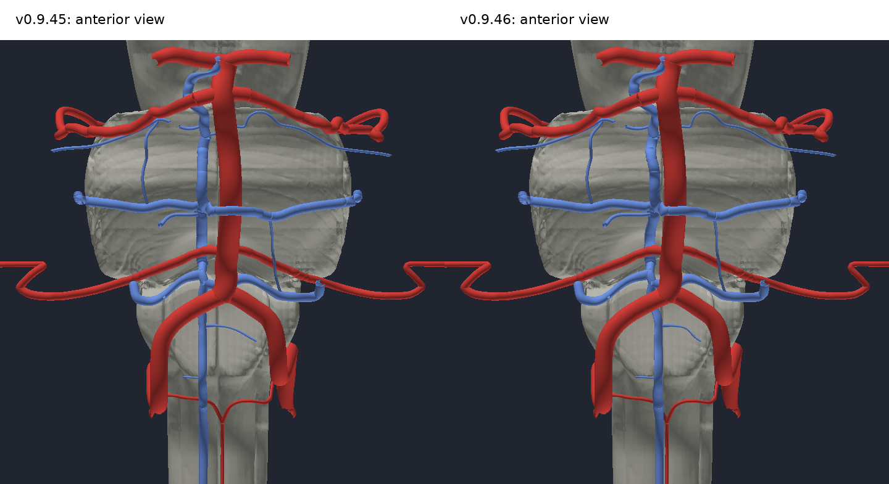
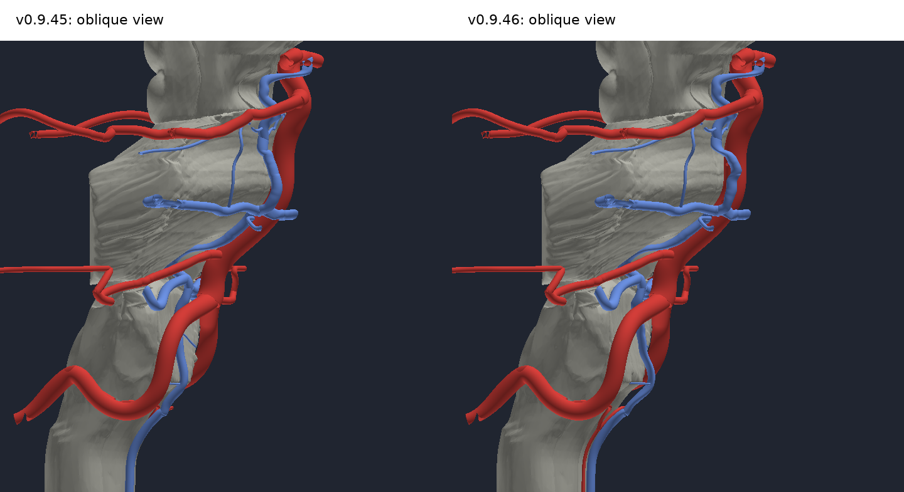

# Anterior brainstem venous audit, v0.9.46

The median anterior veins now lie closer to the midline, beside the arterial axes. Sixteen connected venous labels move together. Arteries, brain, skull, the inferior labial correction and selection effects retain their v0.9.45 geometry or behaviour.

## Anatomical decision

A universal rule that anterior brainstem veins pass in front of every artery would be inaccurate. The median anterior pontomesencephalic channel normally lies on the pial surface between the basilar artery and pons, in or adjacent to the midline. That relationship is retained. Individual crossings were reviewed for clearance rather than imposing a global depth swap.

Sources: [Teksam et al., AJNR 2003](https://pmc.ncbi.nlm.nih.gov/articles/PMC7974009/) and [Kiyosue et al., Neuroradiology 2008](https://doi.org/10.1007/s00234-008-0433-3). The latter also describes the anterior medullary channel's midline course and continuity with the anterior spinal system.

## Cause and correction

The longitudinal median channels had a rightward offset of roughly 3 mm. The earlier v0.9.31 upper crossing field added a further rightward displacement of up to 3 mm locally. This avoided contacts but exaggerated the lateral position. The correction moves the median course medially, with smaller shifts where the basilar artery and branching arteries require clearance. The distal interpeduncular junction is retained.

| Channel | Median x before, mm | Median x after, mm |
|---|---:|---:|
| Median anterior medullary | 2.92 | 1.79 |
| Median anterior pontine | 3.02 | 2.14 |
| Median anterior pontomesencephalic | 3.14 | 2.33 |
| Anterior spinal | 2.75 | 1.05 |

x is positive to the anatomical right; these values describe all mesh vertices, not measured physiological centrelines. The lower medullary shaft approaches x = 1.2 mm, while the anterior spinal shaft approaches x = 1.1 mm. Local shifts preserve sufficient separation from the adjacent arteries.

Local routing also clears pre-existing contacts of the right preolivary and transverse medullary branches with the medulla, and of the left transverse pontine branch with the basilar plexus. The small right preolivary shaft receives a transported wall-profile recovery after placement, retaining its shared collar vertices. The anterior spinal course metadata now includes the already present upper cervical cord target.

## Verification

- Original indices, label identities and vertex counts retained; identical shared collar vertices remain joined.
- All moved triangles checked against every intersecting atlas label, including arteries, brain, skull and neighbouring veins. No new contacts outside shared venous collar adjacency. Existing non-adjacent regional contacts listed above are cleared.
- A sampled positive placement-field Jacobian, minimum 0.390, excludes a sampled coordinate fold. The recovered preolivary wall is checked separately.
- Small selfcontacts already existed in several junction meshes. Raw triangle pair identities change locally, but all additional pair centroids lie within 0.111 mm of existing junction sites in baseline coordinates. The 0.15 mm site regression passes; strict raw pair identity does not. This is not a claim that the complete atlas is watertight or self-intersection free.
- Calibre estimates use original geodesic sections and transported centrelines. Estimates are unreliable at bifurcations and preserved collars; values are recorded without claiming exact physiological calibre.
- Actual Three.js GLTFLoader and MeshoptDecoder check all 217 venous labels for exact loaded positions and indices, with unit normals in changed meshes.

Evidence: [anterior-brainstem-v0.9.46.json](validation/anterior-brainstem-v0.9.46.json). Authoring and verification scripts: `tools/brainstem-v0946/`.

## Matched renders

These are depth-tested renders of the selected audit structures. Arteries are red, veins blue and brainstem grey. Camera, scale and lighting are matched; omitted structures are not included in the comparison view.
