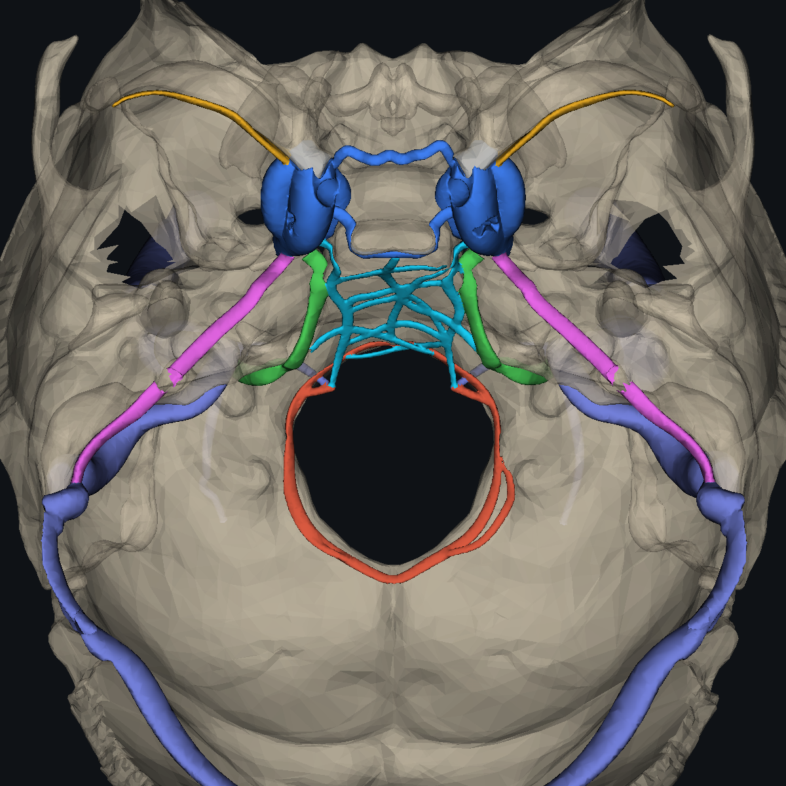
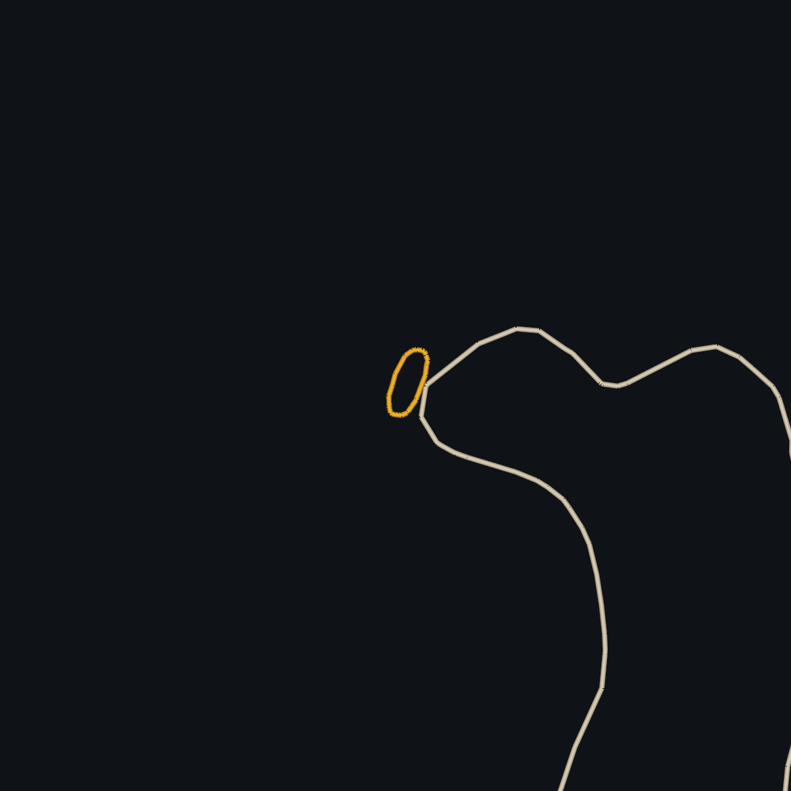
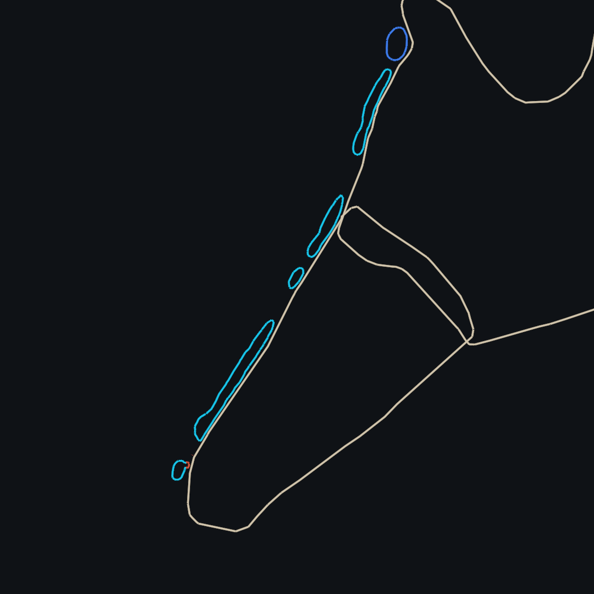
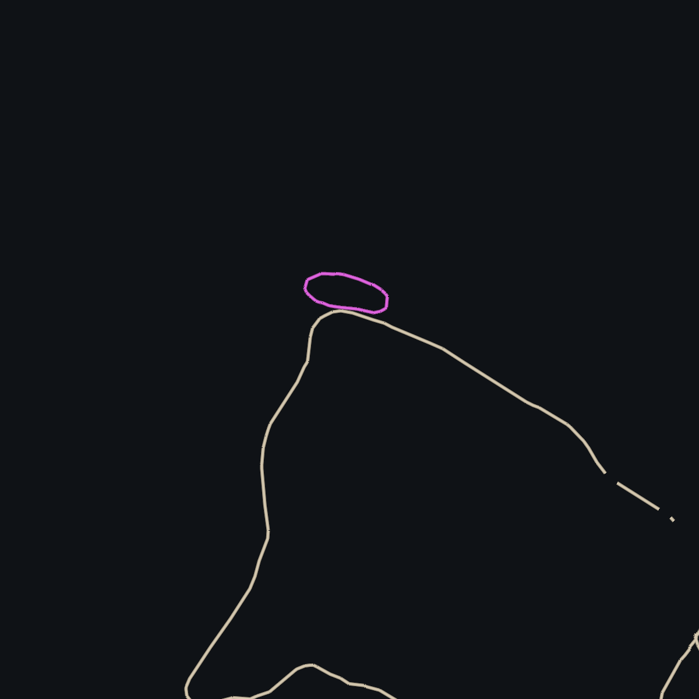
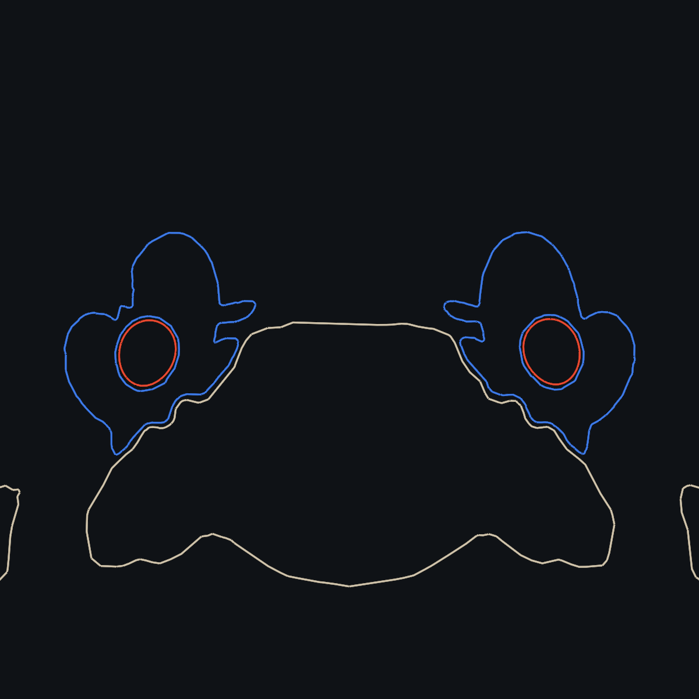

# Venous skull-base morphology review, v0.9.6

4 October 2026. This release implements the six requested regional revisions. The retained bone and arterial models are unchanged. GUI and translucent rendering behaviour remain as in v0.9.5.

## Regions and bony landmarks

| Region | Authored change | Landmark used for placement |
|---|---|---|
| Basilar plexus | Small irregular cross-connected channels, varying calibre and shallow cross-sections; denser superiorly, sparser inferiorly | Intracranial posterior clivus, formed by sphenoid above and basilar occipital bone below. Inferior communications approach the anterior foramen-magnum margin. |
| Sphenoparietal / lesser-wing channels | Thin tapered dural channels, separate from the represented superficial middle cerebral venous entry | Underside/posterior border of the lesser sphenoid wing, entering the anterosuperior cavernous region. Directional fitting avoids the opposite surface of the wing. |
| Cavernous and intercavernous sinuses | Broader connected venous compartments around retained ICA exclusion cavities; lower extension towards petrous entry; smaller sellar cross-connections | Parasellar sphenoid region. Cavernous compartments are not flattened wholesale onto bone. Posterior cross-connection fits the dorsal sellar/upper clival surface. |
| Superior and inferior petrosal sinuses | Separate courses and flattened bone-facing walls; corrected superior cavernous origin and inferior jugular junction | Superior: upper petrous temporal ridge towards transverse-sigmoid junction. Inferior: intracranial petroclival/petro-occipital groove towards anteromedial jugular outlet, not the external petroclival veins. |
| Transverse, sigmoid, jugular | Shallower bone-facing transverse/sigmoid profiles, regional sigmoid fitting and variable bulb calibre | Transverse occipital groove, sigmoid temporal/occipital groove and jugular-foramen transition. Fitting fades before the open lower outlet. |
| Marginal and condylar network | Variable marginal calibre, a smooth closed course, selected small side channels and condylar communications; reduced condylar calibres | Inner occipital rim of the foramen magnum. Condylar routes retain their regional landmarks; the hypoglossal canal lumen is unresolved in the supplied skull. |

Bone-adjacent profiles are oval with a flatter bone-facing wall formed by clipping the envelope to the retained bone boundary before triangulation. Their intracranial faces remain rounded. This is a modelling approximation to dural lumen geometry. The existing superior sagittal rounded-triangular profile is retained. The straight and inferior sagittal sinuses remain free of bone-apposition constraints, since their dural relationships involve the unrendered tentorium/falx.

Fitting uses named local bones, signed surface distances and, where required, a chosen direction of approach. It does not move every sinus to the globally nearest skull surface. Fairing retains broad courses; small medial wing channels also receive a post-fairing clearance correction. Collector attachments remain exact. Sinuses are joined before their common skin is divided into selectable structures.

## References reviewed

The original curated venous collection remains the starting point: Borden (2006), Figures 7.1–7.7; Bradac (2017), Figures 9.5, 9.6, 9.14 and 9.17; and the selected Neuroangio sinus/petrosal venous-phase cases recorded in `VENOUS_v0.9.2.md`. The supplied Lynch notes guide catalogue descriptions and connections. Additional skull-base review used:

1. **Maksim Shapiro, Neuroangio, Cavernous Sinus**: [source page](https://neuroangio.org/venous-brain-anatomy/cavernous-sinus/). Reviewed cavernous venograms in AP/lateral views, clival plexus stereo images and sampling images with bone. These guided compartment outlines and network appearance. Catheter injection and abnormal haemodynamics may enlarge visible channels; their apparent calibres were not copied as measurements.
   - [Cavernous venogram](https://www.neuroangio.org/wp-content/uploads/Venous/V_cavernous_sinus_venogram.png)
   - [Sampling with bone, image courtesy Eytan Raz](https://www.neuroangio.org/wp-content/uploads/Venous/Cavernous-Sinus/Cavernous-Sinus-Sampling-02.jpg)
   - [Clival plexus AP/lateral](https://www.neuroangio.org/wp-content/uploads/Venous/Cavernous-Sinus/Clival-venous-plexus-01.png)
   - [Clival plexus stereo](https://www.neuroangio.org/wp-content/uploads/Venous/Cavernous-Sinus/Clival-venous-plexus-02.png)
   - [Cavernous ICA silhouette](https://www.neuroangio.org/wp-content/uploads/Venous/V_cavernous_sinus_carotid_silhouette_1.png)
2. **San Millán Ruïz et al. (2004)**. *The Sphenoparietal Sinus of Breschet: Does It Exist? An Anatomic Study.* AJNR 25:112–120. [Full text](https://pmc.ncbi.nlm.nih.gov/articles/PMC7974157/). Dissection/corrosion-cast findings and routine angiographic correlation, especially Figure 6, support distinguishing the lesser-wing dural channel from superficial Sylvian drainage. The selected model shows separate entries; it does not claim to exhaust the variants or settle terminology for all sources.
3. **Tubbs et al. (2007)**. *The basilar venous plexus.* Clinical Anatomy 20:755–759. [DOI 10.1002/ca.20494](https://doi.org/10.1002/ca.20494). Supports posterior clival location, variable plexiform architecture and inferior petrosal communications. Lower communications are represented as a selected pattern.
4. **Ekanem et al. (2022)**. *Morphology of the groove of the inferior petrosal sinus: application to better understanding variations and surgery of the skull base.* Anatomy & Cell Biology 55:135–141. [DOI 10.5115/acb.22.023](https://doi.org/10.5115/acb.22.023). Bony groove findings inform the intracranial course from petrous apex towards the anteromedial jugular foramen.
5. **Evans et al. (1996)**. *The marginal sinus normal anatomy and involvement with arteriovenous fistulae.* Interventional Neuroradiology 2:215–221. [DOI 10.1177/159101999600200307](https://doi.org/10.1177/159101999600200307). Angiographic examples and regional anatomy inform the foramen-magnum rim and condylar connections.
6. **San Millán Ruïz et al. (2002)**. *The Craniocervical Venous System in Relation to Cerebral Venous Drainage.* AJNR 23:1500–1508. [Full text](https://pmc.ncbi.nlm.nih.gov/articles/PMC7976803/). Regional venous connections provide context for the marginal/condylar representation.

## Validation and limits

`docs/validation/venous-morphology-v0.9.6.json` records actual exported mesh topology, exact main attachments, named-bone surface-gap sampling and survival of the basilar channels. `tools/venous/review_skullbase.py` generates superior, posterior and lateral views and sectional reviews against the retained bone model. The viewer fixture decodes the compressed delivered GLB with Three.js and checks all 104 selectable venous meshes, picking, clipping, focus and translucent-material restoration. The UI interaction fixture and production build are also run.

Surface-gap and vertex/face-centroid samples are numerical checks on this authored mesh; they do not prove absence of every triangle intersection or establish clinical anatomical accuracy. Visual registration uses the retained skull's own landmarks, not a calibrated patient CT/venogram registration. Small grooves and the hypoglossal canal lumen are incompletely resolved. Cavernous septations and detailed cranial nerve relationships are not modelled. Calibres, branch counts and bilateral pattern remain illustrative. These are reference-guided teaching meshes, not patient-derived segmentations.

No runtime preprocessing, model duplication or extra download is introduced: the revised venous GLB replaces the previous asset.

## Review views

Grey: retained bone. Cyan: basilar plexus. Gold: lesser-wing channels. Blue: cavernous and intercavernous spaces. Magenta: superior petrosal sinuses. Green: inferior petrosal sinuses. Orange: marginal sinus. Slate: transverse/sigmoid/jugular and condylar context.

Section outlines show bone in grey and the venous surfaces in the same regional colours. The cavernous section also shows the retained ICA surfaces in red.

